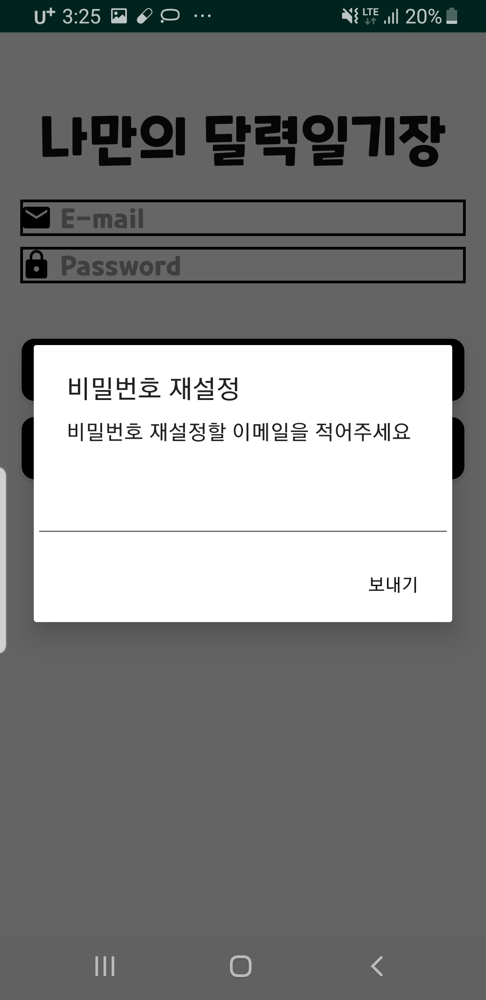

파이어베이스를 사용한 달력 일기장 Application
---------------------------------------------------------
# 기능
1. 파이어베이스 auth를 통한 이메일 로그인,로그아웃,회원가입
2. 로그인 정보를 파이어베이스의 데이터베이스에 저장 및 불러오기
3. calendarview에서 특정 날짜에 이벤트 추가 및 데이터베이스에 추가
4. 오늘 할일을 위젯이나 화면에 띄워주기(예정)
# 개발 기간
- 2020/05/01 ~
# 개발 환경
- Android Studio
- Galaxy S9 
# 화면 구성 및 설명
- [MainActivity.java](https://github.com/cpcp127/FirebaseDatabase/blob/master/DataBase/app/src/main/java/com/example/database/MainActivity.java),
[activity_main.xml](https://github.com/cpcp127/FirebaseDatabase/blob/master/DataBase/app/src/main/res/layout/activity_main.xml)
-로그인,회원가입 버튼, 비밀번호 재설정 버튼이 있는 첫 화면
-어플을 종료해도 다음에 어플을 실행할시 전에 로그인 했던 정보로 자동 로그인
-비밀번호 재설정 버튼 클릭시 alertdialog가 나오며 이메일을 치면 그 이메일로 비밀번호 재설정을 위한 이메일이 발송된다.

  

